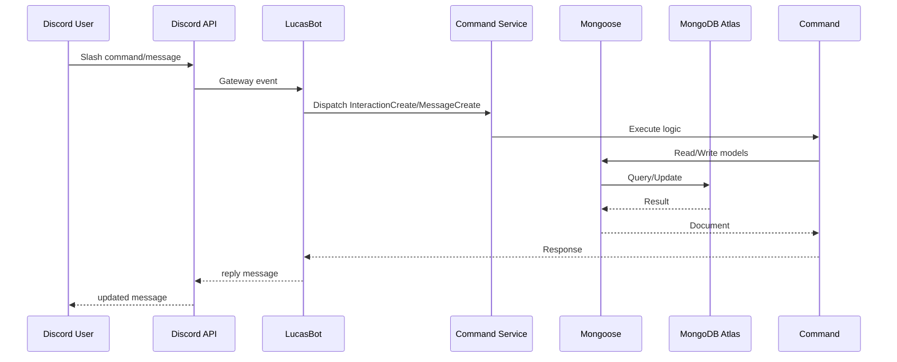

# Request Flow

This document outlines how a Discord interaction travels through LucasBot and ends up persisted in MongoDB.

Steps in detail:

1. A user sends a message or slash command in Discord.
2. Discord forwards the event to LucasBot over its WebSocket gateway.
3. The `discord.js` client dispatches the event to the `CommandService` (or message handler).
4. Command logic uses the Mongoose models (`UserModel`, `QuestModel`, etc.) to query or update MongoDB Atlas.
5. The command replies to Discord with the result, which appears back in the user's client.
